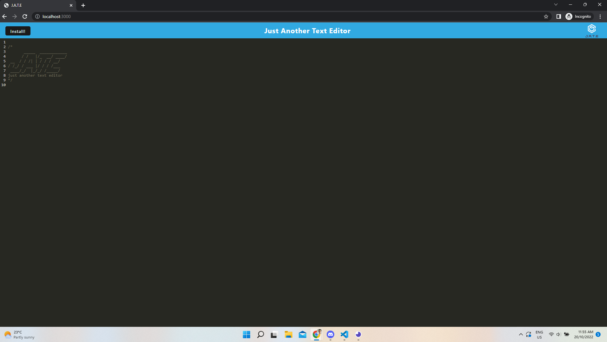

# 18-NoSQL-Challenge-Social-Network-API [](https://opensource.org/licenses/MIT)

This is a back end Mongo application which creates, updates and deletes users, thoughts, friends and reactions. [MIT License](https://opensource.org/licenses/MIT)

## Table of Contents

- [Installation](#installation)
- [Usage](#usage)
- [License](#license)
- [Contributing](#contributing)
- [Tests](#tests)
- [Questions](#questions)

## Installation

To install the application, run the following code...

```shell
npm run seed
node index.js
```

## Usage

After running the seed command, you can use Insomnia to test the routes.

Github repository: https://github.com/SamMarch/18-NoSQL-Challenge-Social-Network-API.git



## License

MIT License (MIT) - [MIT License](https://opensource.org/licenses/MIT)

## Contributing

Sam

## Tests

There are no tests for this application.

## Questions

[SamMarch](https://github.com/)

If you have more questions contact me at...
[marchsam1988@gmail.com](marchsam1988@gmail.com)
